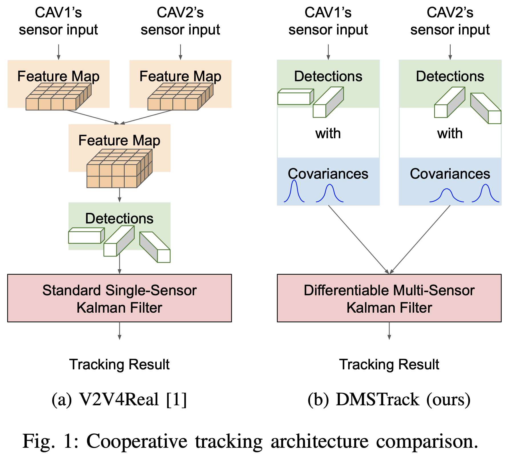

<div align="center">
  
# Probabilistic 3D Multi-Object Cooperative Tracking for Autonomous Driving via Differentiable Multi-Sensor Kalman Filter

Hsu-kuang Chiu<sup>1</sup>, Chien-Yi Wang<sup>2</sup>, Min-Hung Chen<sup>2</sup>, Stephen F. Smith<sup>1</sup>

<sup>1</sup>Robotics Institute, Carnegie Mellon University, <sup>2</sup>NVIDIA Research

IEEE International Conference on Robotics and Automation ([ICRA](https://2024.ieee-icra.org/)), 2024

[project](https://eddyhkchiu.github.io/dmstrack.github.io/)  [arxiv](https://arxiv.org/abs/2309.14655)



</div>

## Overview

We propose a novel algorithm: Differentiable Multi-Sensor Kalman Filter for 3D Multi-Object Cooperative Tracking (DMSTrack). Our algorithm is designed to be capable of estimating observation noise covariance of each detection from different Connected Autonomous Vehicles (CAVs) to better take advantage of the Kalman Filter’s theoretical optimality property: minimizing the expected error of state estimation. 

To train our Differentiable Multi-Sensor Kalman Filter neural network model, we use each detection's local point cloud BEV feature and the positional feature as input. We calculate the regression loss by measureing the difference between the tracking result and the ground-truth. For more details, please refer to our paper at [arxiv](https://arxiv.org/abs/2309.14655).

The experiment results show that our algorithm improves the tracking accuracy by 17% with only 0.037x communication costs compared with the state-of-the-art method in V2V4Real\[1\].

  
## Experiment Result
We exeriment on the V2V4Real \[1\] dataset, which is the first worldwide available public real-world dataset for vehicle-to-vehicle perception with 3D tracking benchmarks. The following table shows the cooperative tracking performance and communication cost in the testing split of V2V4Real \[1\] dataset in comparison with the state-of-the-art CoBEVT+AB3DMOT method. The baseline results contain the one from the V2V4Real \[1\] paper and another one of our implementation.

| Method                             | AMOTA(↑) | AMOTP(↑) | sAMOTA(↑) | MOTA(↑)  | MT(↑)    | ML(↓)    | Cost (MB) (↓)
|------------------------------------|----------|----------|-----------|----------|----------|----------|---------------------------|
| CoBEVT+AB3DMOT \[1\]               | 32.12    | 55.61    | 77.65     | 63.75    | 47.29    | 30.32    | 0.20
| CoBEVT+AB3DMOT (our implementation)| 37.16    | 57.20    | 84.54     | 84.14    | 57.07    | 15.83    | 0.20
| DMSTrack (ours)                    | **43.52**    | **57.94**    | **91.50**     | **88.32**    | **68.35**    | **13.19**    | **0.0073**


The following video shows the visualization of our tracking result. Different colors represent different tracking IDs.


https://github.com/eddyhkchiu/DMSTrack/assets/30642642/d25a7cdf-25da-42ab-b009-47eac4c918c3


## Using our code

You can follow the step-by-step instructions to setup the environment, download the dataset and model checkpoints, run model inference, visualize the tracking results, and train the model from scratch.

- [Setup](docs/SETUP.md)
- [Data](docs/DATA.md)
- [Checkpoint](docs/CHECKPOINT.md)
- [Inference](docs/INFERENCE.md)
- [Train](docs/TRAIN.md)
  

## References

We mainly use the open source code of the following two papers as the reference to implement our algorithm.

- \[1\] *"V2V4Real: A Real-world Large-scale Dataset for Vehicle-to-Vehicle Cooperative Perception"*, Runsheng Xu, Xin Xia, Jinlong Li, Hanzhao Li, Shuo Zhang, Zhengzhong Tu, Zonglin Meng, Hao Xiang, Xiaoyu Dong, Rui Song, Hongkai Yu, Bolei Zhou, Jiaqi Ma, CVPR 2023.
- \[2\] *"A Baseline for 3D Multi-Object Tracking"*, Xinshuo Weng and Kris Kitani, IROS 2020.


## To Cite Our Paper
```
@ARTICLE{chiu2024probabilistic,
  title={Probabilistic 3D Multi-Object Cooperative Tracking for Autonomous Driving via Differentiable Multi-Sensor Kalman Filter},
  author={Chiu, Hsu-kuang and Wang, Chien-Yi and Chen, Min-Hung and Smith, Stephen F.},
  journal={IEEE International Conference on Robotics and Automation (ICRA)},
  year={2024}
}
```
